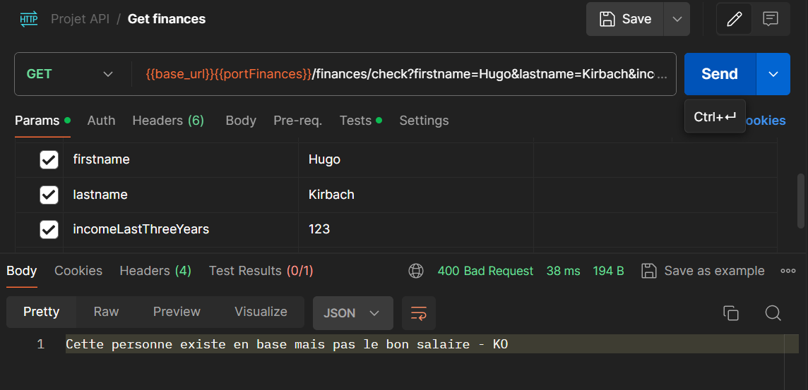

# Projet API - Architecture Orientée Services

Ce projet est une démonstration d'une architecture orientée services utilisant deux services : `bank-service` et `finance-service`.

## Services
### bank-service
Ce service de demande de prêt est conçu pour gérer les opérations liées aux demandes de prêt, telles que la création, la récupération, la mise à jour et la suppression des demandes de prêt. Il permet également de vérifier l'état d'une demande de prêt, de passer une demande de prêt à l'état d'étude, de valider une demande de prêt, d'accepter une demande de prêt validée et de rejeter une demande de prêt en cours de validation.

#### Routes REST
`GET /credits`: Récupère toutes les demandes de prêt existantes.

`GET /credits/{id}`: Récupère une demande de prêt spécifique en fonction de son identifiant.

`GET /credits/check`: Vérifie l'état d'une demande de prêt en fonction du prénom et du nom du demandeur.

`GET /credits/checkFinances`: Vérifie les finances d'un demandeur en effectuant une vérification auprès d'un service externe.

`POST /credits`: Crée une nouvelle demande de prêt.

`PUT /credits/{id}`: Met à jour une demande de prêt existante.

`PUT /credits/{id}/study`: Passe une demande de prêt à l'état d'étude. Conditionné sur l'état actuel de la demande, doit être a Début pour être valide.

`PUT /credits/{id}/validate`: Valide une demande de prêt après vérification. Conditionné sur l'état actuel de la demande, doit être a Etude pour être valide.

`PUT /credits/{id}/accept`: Accepte une demande de prêt validée. Conditionné sur l'état actuel de la demande, doit être a Valide pour que la requete passe.

`PUT /credits/{id}/reject`: Rejette une demande de prêt en cours de validation. Conditionné sur l'état actuel de la demande, doit être a Valide pour que la requete passe.

`DELETE /credits/{id}`: Supprime une demande de prêt spécifique. Cette requete n'est en réalité pas utilisé mais je l'ai implémenté pour pouvoir supprimer mes demandes de prêt lors de mes tests.

### finance-service
#### Routes REST
Ce service est composé d'une seule route de type GET, qui en retour valide ou non les données du revenu des 3 dernières années fournies lors de la creation de la demande de crédit.
La route est la suivante : 

`GET /finances/check?firstname=[...]&lastname=[...]&incomeLastThreeYears=[...]`

Lors de l'appel, le service consulte la base de renseignement et cherche tout d'abord si le client existe. Si c'est le cas, le service compare les revenus des 3 dernières années avec ceux fournis en paramètre. Si tout correspond le service retourne un code 200 avec comme body "OK", sinon il retourne un code 400 avec comme body "KO" et un message correspondant à l'element incorrect (Si la personne n'existe pas en base ou si le revenus déclaré ne correspond pas).

## Utilisation de HATEOAS
Le services `bank-service` utilise le principe HATEOAS pour fournir des liens vers les ressources associées à une ressource donnée. Les liens sont fournis dans les réponses aux requêtes HTTP sous forme de liens hypertextes.

J'ai composé mes retours Hateoas de la sorte :
- Lien vers la ressource actuelle : Un lien est ajouté pour permettre à un client de récupérer les détails de la demande de prêt actuelle.
- Lien vers toutes les demandes de prêt : Un lien est inclus pour permettre au client de récupérer la liste complète de toutes les demandes de prêt.
- Lien pour vérifier l'état de la demande : Un lien est ajouté pour permettre au client de vérifier l'état actuel de la demande de prêt.
- Actions conditionnelles basées sur l'état de la demande : En fonction de l'état actuel de la demande de prêt, des liens sont ajoutés pour permettre au client d'effectuer des actions spécifiques, telles que l'étude, la validation, l'acceptation ou le rejet de la demande de prêt.

## Utilisation de Consul
Les services `bank-service` et `finance-service` utilisent tous les deux Consul, un conteneur Docker est donc nécessaire pour lancer les services.
La configuration de consul est faite dans le fichier application.properties de chaques services.
Consul tape sur le port 8500 par défaut dans ma config, il est donc nécessaire de lancer le conteneur avec le port 8500 exposé ou de changer le port dans les deux fichiers application.properties. 

## Stockage des données
Les données des demandes de prêt sont stockées dans une base de données H2. La base de données est configurée pour être stockée en mémoire, ce qui signifie que les données sont perdues à chaque redémarrage du service. Cela est fait pour des raisons de démonstration, mais il est possible de configurer la base de données pour stocker les données de manière persistante. Les scripts SQL pour peupler la base au démaraage sont dans les dossiers `src/main/resources` des deux services et s'executent automatiquement au démarrage de ces derniers.

## Architecture de l'application
Globalement, mon projet est composé de la manière suivante :

Mes services, eux, sont composées de la manière suivante :

Il en est de même pour le service Finance mais puisqu'il est moins complexe, je n'ai pas jugé utile de le représenter.

## Exemples d'utilisation/execution de mes routes
### Routes
Je vais maintenant vous montrer des exemples d'utilisation de mes routes pour les deux services, sur les routes les plus interessantes selon moi.
Dans la suite de cette documentation, je vais utiliser l'outil Postman pour effectuer les requêtes HTTP.
Si certaines certaines routes essentielles vous semblent manquantes, n'hésitez pas à jeter un coups d'oeil dans le dossier imagesReadMe, il se pourrait que j'ai oublié d'en citer.

`GET /credits/{id}`

`GET /credits/check`

`POST /credits`

`PUT /credits/{id}`

`PUT /credits/{id}/study`

`PUT /credits/{id}/validate`

Cas où tout est correct :

Cas où la demande n'est pas en état d'étude :

Cas où la demande est incorrecte avec les elements envoyés :

`GET /finances/check`
Version où tout est correct :

Version où le revenu déclaré ne correspond pas :

Version où la personne n'existe pas en base :

### Circuit breaker sur Finance-service

